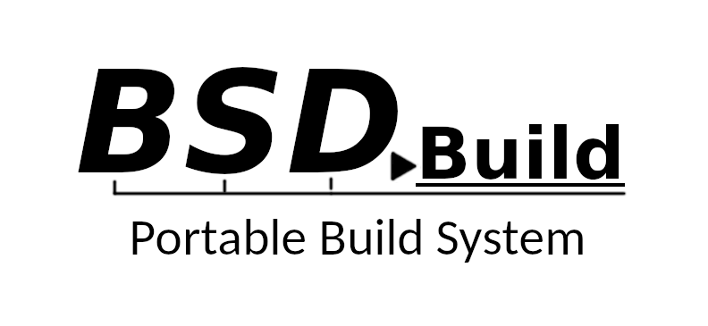

### What is it?

BSDBuild is a compact, cross-platform build system which follows the Principle of Least Astonishment. Derived from the traditional 4.4BSD make libraries, BSDBuild allows programs and libraries to be built portably using simple BSD-style `Makefiles` (without BSD make extensions). BSDBuild works on most operating systems and make flavors.

It can generate Bourne configure scripts, `foo-config` installation scripts, pkg-config `.pc` files and platform-specific application/framework bundles. BSDBuild-generated `configure` scripts look and function similar to a GNU autotools generated script, although BSDBuild uses a different `configure.in` language.

The base distribution currently includes over 100 built-in [Test Modules](https://bsdbuild.hypertriton.com/tests.html) for detecting and testing the compatibility of various software. New test modules can be written quickly. BSDBuild tests can also be used from [CMake](https://cmake.org). The `configure` script generator outputs a CMake macro package that contains all BSDBuild tests available as CMake macros.

For an introductory tutorial, see the [FAQ](https://bsdbuild.hypertriton.com/faq.html). Please direct any issues, comments or suggestions to [GitHub Issues](https://github.com/JulNadeauCA/BSDBuild/issues). You can chat with the developers over at the [LibAgar Discord](https://libagar.org/discord).

### Components

* [mkconfigure](https://bsdbuild.hypertriton.com/man1/mkconfigure): Generate portable Bourne configure scripts.
* [build.common.mk](https://bsdbuild.hypertriton.com/man5/build.common.mk): Common definitions (filesystem paths, etc).
* [build.man.mk](https://bsdbuild.hypertriton.com/man5/build.man.mk): Process mdoc sources into ASCII, PostScript, PDF and HTML.
* [build.lib.mk](https://bsdbuild.hypertriton.com/man5/build.lib.mk): Compile (or cross-compile) static or shared libraries from sources (Ada, assembly, C, C++, Objective C, Lex, Yacc).
* [build.prog.mk](https://bsdbuild.hypertriton.com/man5/build.prog.mk): Compile (or cross-compile) programs from sources (Ada, assembly, C, C++, Objective C, Lex, Yacc).
* [build.www.mk](https://bsdbuild.hypertriton.com/man5/build.www.mk): Compile HTML documents (and optionally language/character set variants) from sources using `m4` and `xsltproc`.

### Availability

#### Latest Stable Release

* [Download Source](https://bsdbuild.hypertriton.com/download.html)
* On FreeBSD: ***pkg install bsdbuild***

#### Latest Development Sources

* Main Repo: [https://dev.csoft.net/bsdbuild/trunk](https://dev.csoft.net/bsdbuild/trunk)
* On GitHub: [JulNadeauCA/bsdbuild](https://github.com/JulNadeauCA/bsdbuild)

#### License

* [BSD 2-Clause License](https://bsdbuild.hypertriton.com/license.html)

### Contributing

#### Support on Patreon

You can support the BSDBuild project through the [LibAgar Patreon](https://patreon.com/libagar).

