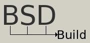

### What is it?

BSDBuild is a self-contained, portable build system in the spirit of the traditional 4.4BSD make library files. It allows BSD-style makefiles to be used without the need for either BSD or GNU make extensions. It is portable to most operating systems and make flavors.

In addition, BSDBuild includes a configure script compiler and a number of software test modules.

### Components

* [mkconfigure](https://bsdbuild.hypertriton.com/mdoc.cgi?man=mkconfigure.1): Generate portable Bourne configure scripts.
* [build.lib.mk](https://bsdbuild.hypertriton.com/mdoc.cgi?man=build.lib.mk.5): Compile (or cross-compile) static or shared libraries from sources (Ada, assembly, C, C++, Objective C, Lex, Yacc).
* [build.prog.mk](https://bsdbuild.hypertriton.com/mdoc.cgi?man=build.prog.mk.5): Compile (or cross-compile) programs from sources (Ada, assembly, C, C++, Objective C, Lex, Yacc).
* [build.man.mk](https://bsdbuild.hypertriton.com/mdoc.cgi?man=build.man.mk.5): Process mdoc sources into ASCII, PostScript, PDF and HTML.
* [build.proj.mk](https://bsdbuild.hypertriton.com/mdoc.cgi?man=build.proj.mk.5): Generate "Project files" for IDEs such as **Code::Blocks** and **Visual Studio**.

### Availability

#### Latest Stable Release

* [Download Source](https://bsdbuild.hypertriton.com/download.html)
* On FreeBSD: ***pkg install bsdbuild***

#### Latest Development Sources

* Main Repo: [https://dev.csoft.net/bsdbuild/trunk](https://dev.csoft.net/bsdbuild/trunk)
* On GitHub: [JulNadeauCA/bsdbuild](https://github.com/JulNadeauCA/bsdbuild)

#### License

* [BSD 2-Clause License](https://bsdbuild.hypertriton.com/license.html)

### Contributing

#### Support on Patreon

You can support the BSDBuild project through the [LibAgar Patreon](https://patreon.com/libagar).

